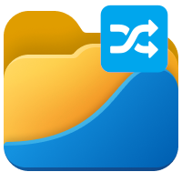

<h1 align="center">Random Folder 📁</h1>

<h3 align="center">Random Folder is an <s>lightweight and blazingly fast</s> app that pick a random subfolder inside of a main folder.</h3>

## About

This app was made thanks to [`Wails`](https://wails.io/) which is a **lightweight alternative to Electron** with **golang as a _BackEnd_** and **Any WebFrameworks for the _FrontEnd_**.

I've used [`svelte`](https://svelte.dev/) for the FrontEnd

> PS: Actually this is the 2nd version of this app; the first one was made with the framework [tauri](https://tauri.app/) _(which is the rust equivalent of wails)_ and [preact](https://preactjs.com/); I choose to remake it because the 1st version (tauri) is not compiling anymore _(maybe due to the fact that it's an old version, that in the meantime I switched of from window to linux, that I don't even have the same machine anymore; maybe...)_ and I only have the windows executable (I'm on linux now...)
> The first version can be found in the branches of this repo: [tauri-old](https://github.com/Ilingu/random-folder/tree/tauri-old)

## Install

### ⚡ `[DISCLAIMER]`:: This app is not production ready and will never be, it's just a side project of mine to test the so called "wails" framework

### 🪟 If you have linux you can download the app binary in the [`realease page`](https://github.com/Ilingu/random-folder/releases) of this repo

To Install this app you will have to bundle it yourself (since it was not design to be installed)

> Before installing this app, be sure to install the [Wails's dependencies](https://wails.io/docs/next/gettingstarted/installation) for you OS

1. Clone this repo into you local machine: `git clone https://github.com/Ilingu/random-folder.git`
2. Run `wails build`, [further instruction](https://wails.io/docs/next/gettingstarted/building)
   1. if you have an error and on windows you might want to install [NSIS](https://wails.io/docs/guides/windows-installer/) (idk I'm not on windows; just helping)
3. Run the binary (in `build/bin`)
4. Done!

PS: if you want to **change my code** you can run: `wails dev` to launch the app in _dev mode_

# Purpose and motivation

The idea of this app come from a **very specific** problem that I encounter in a daily basis. So to automate this problem I build this app (logic 🪄)
